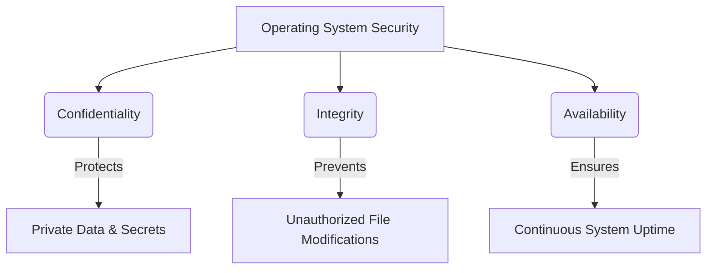

# 💻 Operating System Security, CLI Fundamentals & Attack Vectors

---

## 📌 1. OS Architecture & Privilege Boundaries

An **Operating System (OS)** serves as the central software manager operating directly between physical hardware components (CPU, Memory, Storage) and user-facing applications. 

### Hardware to Application Abstraction Layer
```
┌─────────────────────────────────────────────────────────────┐
│                 Applications & Software                     │
│           (Firefox, Chrome, MS Office, Telegram)            │
└──────────────────────────────┬──────────────────────────────┘
│ System Calls (sys_open, sys_read)
┌──────────────────────────────▼──────────────────────────────┐
│                  Operating System (Kernel)                  │
│             (Windows, macOS, Linux, Android, iOS)           │
└──────────────────────────────┬──────────────────────────────┘
│ Hardware Abstraction Layer (HAL)
┌──────────────────────────────▼──────────────────────────────┐
│                    Hardware Infrastructure                  │
│            (CPU, Memory, Storage, Network Interface)        │
└─────────────────────────────────────────────────────────────┘
```
---

### Privilege Rings & Memory Separation
```
     ┌──────────────────────────────────────────┐
     │  Ring 3: User Mode (Applications/Apps)   │
     │  ┌────────────────────────────────────┐  │
     │  │  Ring 1/2: Drivers / OS Services   │  │
     │  │  ┌──────────────────────────────┐  │  │
     │  │  │  Ring 0: Kernel Mode (OS Core)│ │  │
     │  │  │  [ Direct Hardware Control ] │  │  │
     │  │  └──────────────────────────────┘  │  │
     │  └────────────────────────────────────┘  │
     └──────────────────────────────────────────┘
```
* **Kernel Space vs. User Space:** Ring 0 holds full system control, whereas Ring 3 applications must request access via strict system calls.
* **Interface Abstraction:** Security analysts interact with the OS through a Graphical User Interface (GUI) or a Command Line Interface (CLI) for speed, automation, and deep administrative control.

---

## 🔺 2. The CIA Triad & Threat Topology

Securing any operating system requires upholding three foundational security pillars:
```
                   [ CONFIDENTIALITY ]
                  /                   \
                 /                     \
                /    OPERATIONAL OS     \
               /       SECURITY          \
              /                           \
    [ INTEGRITY ] ═════════════════ [ AVAILABILITY ]
```

Confidentiality: Guarantees that sensitive files and keys are accessed exclusively by authorized user accounts.

Integrity: Ensures system binaries and configuration files remain untampered with and authentic.

Availability: Protects system uptime and computing resources against DoS or crash exploits.

---

## 🔑 3. Authentication & Password Vectors
Weak, predictable credentials (123456, password, dragon) or common keyboard trajectories (qwerty, 1q2w3e4r5t) are the most common initial access vectors exploited via automated brute-force attacks.

Keyboard Trajectory & Dictionary Brute-Force Mechanics
```
┌───────────────────────────────────────────────────────────┐
│              QWERTY Spatial Keyboard Layout               │
├───────────────────────────────────────────────────────────┤
│ [1]  [2]  [3]  [4]  [5]  [6]  [7]  [8]  [9]  [0]          │
│   [Q]  [W]  [E]  [R]  [T]  [Y]  [U]  [I]  [O]  [P]      │
│     [A]  [S]  [D]  [F]  [G]  [H]  [J]  [K]  [L]         │
└───────────────────────────────────────────────────────────┘
   │                      │
   └──► Sequential Slide ─┴──► Password Vector: "1q2w3e4r5t"
        (Predictable paths are indexed in attack wordlists)
```
Password Attack Flow
```
Password Attack Flow
┌──────────────┐     Wordlist / Rule Engine     ┌──────────────┐
│ Attacker CLI │ ──────────────────────────────►│ SSH / OS Auth│
└──────────────┘    "123456", "qwerty", etc.    └──────────────┘
                                                        │
                                                        ▼
                                                [ ACCESS GRANTED ]
```

---

## ⚠️ 4. File Permissions & Malicious Software Mechanics
Operating system security weaknesses are primarily exploited through weak privilege enforcement or unauthorized executable execution:

Trojan Execution Flow
```
                      ┌─────────────────────────┐
                      │  User Downloads Binary  │
                      │  ("update_installer")   │
                      └────────────┬────────────┘
                                   │
                                   ▼
                      ┌─────────────────────────┐
                      │   Trojan Execution    │
                      └────────────┬────────────┘
                                   │
         ┌─────────────────────────┴─────────────────────────┐
         ▼                                                   ▼
┌─────────────────────────┐                         ┌─────────────────────────┐
│ Confidentiality Breach  │                         │    Integrity Breach     │
│ (Exfiltrates Passwords) │                         │ (Modifies System Files) │
└─────────────────────────┘                         └─────────────────────────┘
```
Weak File Permissions: Violating the Principle of Least Privilege allows low-privilege accounts to inspect confidential files or overwrite critical binaries, leading directly to privilege escalation.

Malicious Programs (Trojans): Disguised binaries trick users into running unauthorized code, establishing remote backdoors and compromising system integrity.

---

## 🖥️ 5. Command Line Interface (CLI) Audit Reference
Terminal environments are the primary workspace for SOC analysts, digital forensics investigators, and security engineers. The table below summarizes essential diagnostic primitives:


| Assessment Domain | Command | Functional Purpose & Security Value |
| :--- | :--- | :--- |
| **Current Directory** | `pwd` | Outputs current absolute workspace directory path. |
| **Directory Enumeration** | `ls -la` | Displays all files (including hidden `.file` items) with permission bits and ownership. |
| **Directory Navigation** | `cd <path>` | Shifts active directory location (`..` moves up one parent level). |
| **Artifact Search** | `find ~ -name <file>` | Scans directory tree recursively to locate matching filename patterns. |
| **File Display** | `cat <file>` | Streams raw text file contents directly onto terminal output. |
| **User Identity** | `whoami` | Identifies active execution context and privilege context. |
| **Kernel Audit** | `uname -a` | Displays host platform name, kernel release build, and hardware architecture. |
| **Storage Utilization** | `df -h` | Summarizes mounted partitions and available capacity in human-readable notation. |
| **Distribution Metadata** | `cat /etc/os-release` | Parses underlying OS build specifications, ID, and release distribution details. |

---

## 💻 6. Remote SSH Access & System Audit Execution
Gaining administrative access (root on Linux/macOS or Administrator on Windows) gives an operator unrestricted authority over host processes, network sockets, and file permissions.

Remote Connection Sequence
```
┌──────────────────┐    Encrypted SSH Tunnel    ┌──────────────────┐
│  Analyst / SOC   │ ─────────────────────────► │   Remote Linux   │
│   Workstation    │  ssh sammie@10.10.x.x      │   Host / Server  │
└──────────────────┘                            └──────────────────┘
```

```
Hands-on Session Log
# Step 1: Establish an encrypted SSH tunnel to the target host
user@AttackBox# ssh sammie@<TARGET_IP>

# Step 2: Confirm active privilege context immediately upon connection
sammie@beginner-os-security:~$ whoami
sammie

# Step 3: Inspect active directory contents for staged artifacts or sensitive files
sammie@beginner-os-security:~$ ls -la
drwxr-xr-x 2 sammie sammie 4096 Mar  1 14:45 .
-rw-r--r-- 1 sammie sammie  111 Mar  1 14:40 country.txt
-rw-r--r-- 1 sammie sammie  439 Mar  1 14:42 draft.md
-rw------- 1 sammie sammie  220 Mar  1 14:45 password.txt

# Step 4: Extract target file contents to retrieve operational data
sammie@beginner-os-security:~$ cat draft.md
# Operating System Security
Reusing passwords means that your password for other sites becomes exposed if one service is hacked.

# Step 5: Audit command history to discover past administrative activity
sammie@beginner-os-security:~$ history
```

---

## 🧪 7. Practical Audit & File Recovery Workflow
```
[ find ~ -name "day1_report.txt" ] ──► Locates File Path
               │
               ▼
   [ cd /path/to/directory/ ]      ──► Navigates to Location
               │
               ▼
      [ cat day1_report.txt ]      ──► Displays Token

```

Lab Diagnostic Log
```
# Step 1: Baseline system diagnostics
ubuntu@soc-workstation:~$ whoami
ubuntu

ubuntu@soc-workstation:~$ uname -a
Linux soc-workstation 6.8.0-31-generic #31-Ubuntu SMP Mon May 13 15:58:18 UTC 2024 x86_64 GNU/Linux

ubuntu@soc-workstation:~$ df -h
Filesystem      Size  Used Avail Use% Mounted on
/dev/root        20G   12G  8.0G  60% /
tmpfs           1.9G     0  1.9G   0% /dev/shm
/dev/sda1       511M  6.0M  505M   2% /boot/efi


# Step 2: Extract OS distribution metadata
ubuntu@soc-workstation:~$ cat /etc/os-release
NAME="Ubuntu"
VERSION="24.04 LTS (Noble Numbat)"
ID=ubuntu
ID_LIKE=debian
PRETTY_NAME="Ubuntu 24.04 LTS"

# Step 3: Search and extract target verification token
ubuntu@soc-workstation:~$ find ~ -name "day1_report.txt"
/home/ubuntu/documents/reports/day1_report.txt

ubuntu@soc-workstation:~$ cd /home/ubuntu/documents/reports/
ubuntu@soc-workstation/documents/reports$ cat day1_report.txt
===================================================
 VERIFICATION TOKEN: XXX
 Status: Baseline Audit Completed Successfully.
===================================================
```
